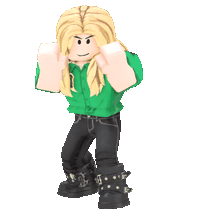

# 3D Sprite Sheet Builder
# Pete Baron + Claude Code 2026

Renders skinned GLB characters through their animation clips from a fixed
orthographic camera and packs the frames into a sprite sheet, alongside a
bone-coloured segmentation map and a JSON file describing the result.

Intended as source material for a generative image model: the beauty pass gives
the character, the bone map removes every ambiguity about which limb is which
(left vs right, hand vs forearm) even when the pose self-occludes.



Sixteen frames of one clip, packed 8x2 and played back from the sheet at the
timings in the JSON, via `tools/sheet_to_gif.py`.

## Adding models

Drop GLBs into `models/` and run:

    python tools/prepare_models.py

It reads each file's embedded glTF JSON and regenerates `js/catalog.js`:

- **Characters** are files with a skin and geometry. Files whose name contains
  `@` are treated as Mixamo animation carriers and listed as clips only, and
  files sharing an identical skeleton and vertex count with an earlier file are
  the same figure in a different clip, so only the first becomes a character.
- **Clips** are files carrying animation. A file in both lists is
  self-contained and retargets onto itself.
- **Display names are preserved** across runs, keyed on file name. Rename an
  entry in `catalog.js` and it sticks.

The report flags what will actually go wrong: missing anchor bone, bones the
palette does not match, clips too short to be real animations, and - most
usefully - which characters each clip can retarget onto, since retargeting is by
bone name and a clip from one rig convention will not drive another.

`--check` reports without writing and exits non-zero if the catalog is stale.
`--verbose` lists every unmatched bone name.

The palette rules and anchor patterns are parsed out of `js/boneColor.js` and
`js/loader.js` rather than duplicated, so the script cannot drift from what the
tool actually does.

## Running it

Serve the folder over HTTP and open `index.html` - the GLB loading needs a real
server, `file://` will not work.

    python -m http.server 8765

then http://127.0.0.1:8765/index.html, or through WAMP at
http://localhost/host_level/three_d_sprite_sheet/

Pick a character and clip, set the camera angle, press **Capture sheet**, then
download the beauty PNG, the bone-map PNG and the JSON.

## What the capture does

**Fixed orthographic camera.** Perspective would change limb proportions frame
to frame as the pose moves in depth. Yaw and pitch never change during a
capture; the camera is positioned by hand rather than orbited, because
`ArcRotateCamera.setTarget()` recomputes its angles from the old position.

**Centre-of-mass lock.** The hips bone is pinned to a fixed screen position, so
the figure cannot wander inside the cell however much the clip translates. The
travel that pinning removes is measured first, against a stationary camera, and
written to the JSON so the original motion can be replayed exactly. Unticking
"Lock vertical" keeps falls and jumps visible in the cell; the horizontal lock
always applies.

**Crop to content.** Every frame is rendered full size, then one crop
rectangle - the union of all frames' alpha bounds plus padding - is applied to
all of them. A shared rectangle means uniform cells with no scale jitter.

**Auto-fit.** Before capturing, the clip is measured and the ortho height set so
the widest pose fills about 90% of the frame. Without it, an extreme pose can be
clipped by the viewport and the crop silently loses part of the figure.

## Rig conventions

Two naming conventions are supported, and they can be mixed in one folder:

- **Mixamo** - `Hips`, `LeftForeArm`, `RightUpLeg`, with or without the
  `mixamorig:` prefix.
- **Unreal mannequin** - `pelvis`, `spine_01`, `clavicle_l`, `upperarm_l`,
  `lowerarm_l`, `hand_l`, `thigh_l`, `calf_l`, `foot_l`, with a trailing index
  on every bone.

Both map to the same palette, and `_l` means the character's own left just as
Mixamo's `Left` does, so the colours mean the same thing across rigs.

Retargeting, though, is strictly by bone name: a Mixamo clip cannot drive an
Unreal-named skeleton or the reverse. `prepare_models.py` shows which clips pair
with which characters.

To support a third convention, add rules to `REGIONS` in `js/boneColor.js`
(first match wins, so append rather than insert) and an anchor pattern to
`ANCHOR_PATTERNS` in `js/loader.js`.

## Animation preview

After a capture, the preview plays the sheet back at the clip's real timing,
with a Beauty / Bone map switch, play-pause, single stepping, a scrubber and a
speed control.

It is deliberately built on nothing but the sheet canvas and the JSON, using the
same compositing recipe documented below. So it is not only a look at the
animation, it is a check that the metadata is complete: if the travel replays
correctly here, it will replay correctly for anything else consuming the files.

- **Replay travel from JSON** adds `rootOffsetPx` back, so the figure moves the
  way the original clip did. Untick it to see the locked, in-place version -
  the canvas then shrinks to exactly one cell.
- **Show anchor path** draws the hips track across the whole clip and marks the
  current frame, which is the quickest way to confirm the offsets are sane.

## Bone map

Each vertex's dominant bone (highest skinning weight) decides its colour, baked
once into the mesh's vertex colour buffer. Babylon's normal skinning then
carries the colours through the animation, so the two passes align exactly.

The palette is defined in `js/boneColor.js` as ordered regex rules over bone
names, covering both supported rig conventions. Warm ramp for the character's left arm, cool for the right, green
for the left leg, magenta for the right, with hands and feet as the bright
highlights. Bones matching no rule come out mid grey, and the UI reports them.

Colours are written to the vertex buffer in linear space, because the unlit PBR
pass converts back to sRGB on output. The sheet therefore carries the exact RGB
values shown in the legend.

## JSON format

```json
{
  "character": "Roblox Rocker",
  "clip": "Punching",
  "source":  { "fps": 60, "fromFrame": 0, "toFrame": 76, "loops": true },
  "camera":  { "projection": "orthographic", "yawDeg": 0, "pitchDeg": 8,
               "orthoHeightUnits": 2.39, "pixelsPerUnit": 160.7 },
  "anchor":  { "bone": "mixamorig:Hips", "lockedAxes": ["x", "y", "z"] },
  "cell":    { "width": 263, "height": 334, "padding": 8 },
  "sheet":   { "width": 1052, "height": 668, "cols": 4, "rows": 2,
               "frameCount": 8 },
  "frames": [
    {
      "index": 0,
      "sourceFrame": 0,
      "timeSeconds": 0,
      "cell":            { "x": 0, "y": 0 },
      "anchor":          { "x": 143, "y": 181 },
      "contentBox":      { "x": 8, "y": 12, "width": 224, "height": 407 },
      "rootOffsetPx":    { "x": 0, "y": 0 },
      "rootOffsetWorld": { "x": 0, "y": 0, "z": 0 }
    }
  ]
}
```

- `cell` - where this frame sits in the sheet. Every cell is `cell.width` x
  `cell.height`.
- `anchor` - where the hips bone sits inside the cell, in pixels. Use it as the
  registration point when compositing.
- `contentBox` - the frame's own alpha bounds inside the cell, if you want to
  repack tighter later.
- `rootOffsetPx` - the travel removed by the lock, in screen pixels relative to
  frame 0. Add it back to replay the original motion.
- `rootOffsetWorld` - the same travel in world units, for feeding a physics or
  movement system rather than a blitter.

Compositing one frame so its hips land at `(targetX, targetY)`:

```js
const f = meta.frames[i];
ctx.drawImage(
    sheet,
    f.cell.x, f.cell.y, meta.cell.width, meta.cell.height,
    targetX - f.anchor.x + f.rootOffsetPx.x,
    targetY - f.anchor.y + f.rootOffsetPx.y,
    meta.cell.width, meta.cell.height
);
```

Drop the `rootOffsetPx` terms to keep the figure locked in place.

## Turning a sheet into a GIF

`tools/sheet_to_gif.py` reads a downloaded sheet and its JSON and writes an
animated GIF - useful for checking a capture outside the browser, or for
dropping into a README. It needs Pillow.

    python tools/sheet_to_gif.py sheet.png sheet.json out.gif --height 220

Either sheet works: pass the beauty PNG for the character, the bone-map PNG to
see the segmentation animate. Frame delays come from each frame's
`timeSeconds`, so the GIF runs at the source clip's speed, and the loop flag in
the JSON decides whether the last frame holds or wraps.

    --height N     scale so each cell is N pixels tall (default: full size)
    --travel       replay the root motion the anchor lock removed, widening
                   the canvas to fit the whole path
    --bg #RRGGBB   flatten onto this colour; without it the GIF keeps a
                   transparent index and the figure sits on nothing
    --fps N        override the rate from the JSON

Without `--travel` the figure is pinned by its anchor exactly as it sits in the
cell - the same difference as dropping the `rootOffsetPx` terms above. The
sheet and the JSON must be from the same capture; a mismatch in cell count or
sheet size is an error rather than a silently wrong GIF.

The README image was made with:

    python tools/sheet_to_gif.py rocker_mmakick.png rocker_mmakick.json docs/example_kick.gif --height 220

## Files

    index.html      UI
    selftest.html   headless smoke test - runs the pipeline and draws both
                    sheets, ends its report with PASS or FAIL
    js/catalog.js   character and clip lists
    js/rig.js       Babylon scene, orthographic camera, flat lighting
    js/loader.js    GLB loading and Mixamo retargeting
    js/boneColor.js dominant-bone vertex colouring and the palette
    js/capture.js   frame stepping, measuring, cropping, packing, metadata
    js/preview.js   sheet playback, driven only by the sheet and the JSON
    js/app.js       UI wiring
    lib/            Babylon 8 plus the GLB decoders
    models/         copied from the game's models/ folder - not in the repo,
                    see models/README.md
    tools/prepare_models.py  rescan models/ and regenerate the catalogue
    tools/sheet_to_gif.py    turn a captured sheet plus its JSON into a GIF
    docs/           README images

## Gotchas worth knowing

**Animation blending must be off.** Retargeted clips are loaded with
`enableBlending = false`; with blending on, `goToFrame()` eases towards the pose
over time instead of snapping to it, and every captured frame is subtly wrong.

**The capture loop has to yield.** Babylon finalises a new shader effect on a
timer and silently skips any mesh whose effect is not ready. A synchronous
render loop produces entirely empty frames with no error. `Capture.prepare()`
compiles both passes and awaits readiness before capture starts, and the frame
loop yields to the event loop each iteration.

**`StandardMaterial.disableLighting` does nothing in Babylon 8.** The default
shader no longer has a `DISABLELIGHTING` branch, so it renders black. The flat
pass uses `PBRMaterial.unlit` instead.

**Hand bones.** Several imported characters have malformed hand bones. The
"skip hand bones" option leaves them in their rest pose rather than letting the
retargeted animation deform them into a mess. Turn it off for characters whose
hands are clean.
